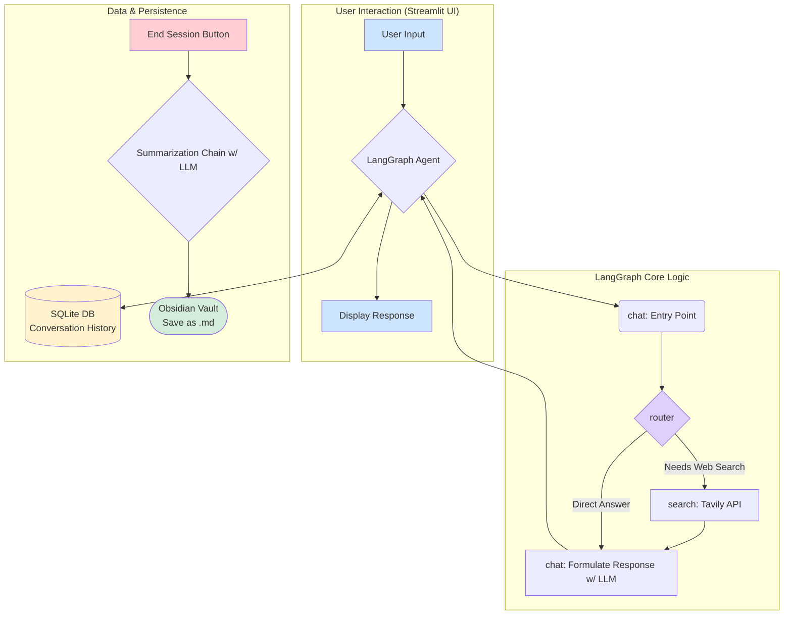

# CogniGraph 🧠

CogniGraph is an AI-powered research assistant designed to help you learn new concepts. It provides a conversational interface to explore topics, performs real-time web searches for up-to-date information, and summarizes key points at the end of your session.

A key feature of CogniGraph is its integration with Obsidian. It automatically saves summarized notes to your vault, wrapping related concepts in `[[double brackets]]` to leverage Obsidian's powerful graph view and create a connected knowledge base.

This project is built using LangGraph, Streamlit, and can be configured to use different Large Language Models (LLMs) like local models via Ollama or proprietary models from OpenAI.

## Architecture Diagram

The following diagram illustrates the flow of information within the CogniGraph agent:



## Features

- **Conversational AI**: Engage in a natural conversation to ask questions and learn.
- **LLM Agnostic**: Easily switch between a locally hosted Ollama model (e.g., Gemma, Llama) and OpenAI's models (e.g., GPT-4o) via a simple configuration change.
- **Web Search**: Integrates with Tavily Search API to provide current information on any topic.
- **Intelligent Routing**: The agent decides whether to answer from its existing knowledge or perform a web search.
- **Automated Summarization**: At the end of a session, the agent summarizes the entire conversation, highlighting key takeaways.
- **Obsidian Integration**: Automatically saves summaries as Markdown files in a specified Obsidian vault, creating links between concepts for graph visualization.
- **Persistent Memory**: Conversation history is stored in a local SQLite database, allowing you to pick up where you left off (per session).
- **Simple UI**: A clean and straightforward chat interface built with Streamlit.
- **Logging**: Detailed logs are generated in the `logs/` directory for easy debugging and monitoring.

## Project Structure

```
.
├── .venv/                  # Python virtual environment
├── logs/                   # Log files
│   └── app.log
├── .env                    # Environment variables and configuration
├── app.py                  # Main Streamlit application, agent logic
├── database.py             # SQLite database management
├── requirements.txt        # Python dependencies
└── README.md               # This file
```

## Setup and Installation

1.  **Prerequisites**:
    *   Python 3.9+
    *   An active internet connection
    *   (Optional) [Ollama](https://ollama.com/) installed and running for local LLM usage.

2.  **Clone the Repository**:

3.  **Create a Virtual Environment**:
    It is highly recommended to use a virtual environment to manage dependencies.

    ```bash
    python -m venv .venv
    ```

4.  **Activate the Environment**:
    *   **Windows**:
        ```powershell
        .\.venv\Scripts\Activate.ps1
        ```
    *   **macOS/Linux**:
        ```bash
        source .venv/bin/activate
        ```

5.  **Install Dependencies**:
    Install all required packages using the `requirements.txt` file.

    ```bash
    pip install -r requirements.txt
    ```

6.  **Configure Environment Variables**:
    Create a file named `.env` in the root of the project directory and populate it with your configuration. A template is provided below.

## Configuration (`.env` file)

Copy the following into your `.env` file and replace the placeholder values with your actual information.

```ini
# --- LLM Configuration ---
# Set the provider: "ollama", "openai", etc.
LLM_PROVIDER="ollama" 
# Set the model name for the selected provider (e.g., "gemma", "gpt-4o")
LLM_MODEL="gemma"
# Set the base URL for the LLM API (required for local models like Ollama)
LLM_BASE_URL="http://localhost:11434"

# --- API Keys and Paths ---
# Required if using LLM_PROVIDER="openai"
OPENAI_API_KEY="your-openai-api-key"
# Required for web search functionality
TAVILY_API_KEY="your-tavily-api-key"
# Absolute path to your Obsidian vault's root directory
OBSIDIAN_VAULT_PATH="C:/Users/YourUser/Documents/ObsidianVault"
```

**Important**:
- You can get a free Tavily API key from the [Tavily website](https://tavily.com/).
- Ensure the `OBSIDIAN_VAULT_PATH` is an absolute path to your vault's root directory.

## Usage

1.  **Activate the virtual environment** if you haven't already.

2.  **(Optional) Start Ollama**: If you are using `LLM_PROVIDER="ollama"`, make sure your Ollama application is running and the specified model (`gemma` by default) is downloaded.
    ```bash
    ollama run gemma
    ```

3.  **Run the Application**:
    Start the Streamlit application from your terminal.

    ```bash
    streamlit run app.py
    ```

4.  **Interact with the Agent**:
    - Open the URL provided by Streamlit (usually `http://localhost:8501`) in your web browser.
    - Type your questions into the chat input at the bottom of the page.

5.  **Save Notes**:
    - When you are finished with a topic, click the **"End Session & Save Notes"** button.
    - The agent will summarize the conversation and save it as a new Markdown file in the `AINotes` folder inside your specified Obsidian vault.

## Logging

All application events, including API calls, node executions, and errors, are logged to `logs/app.log`. This is the first place to check if you encounter any issues.
