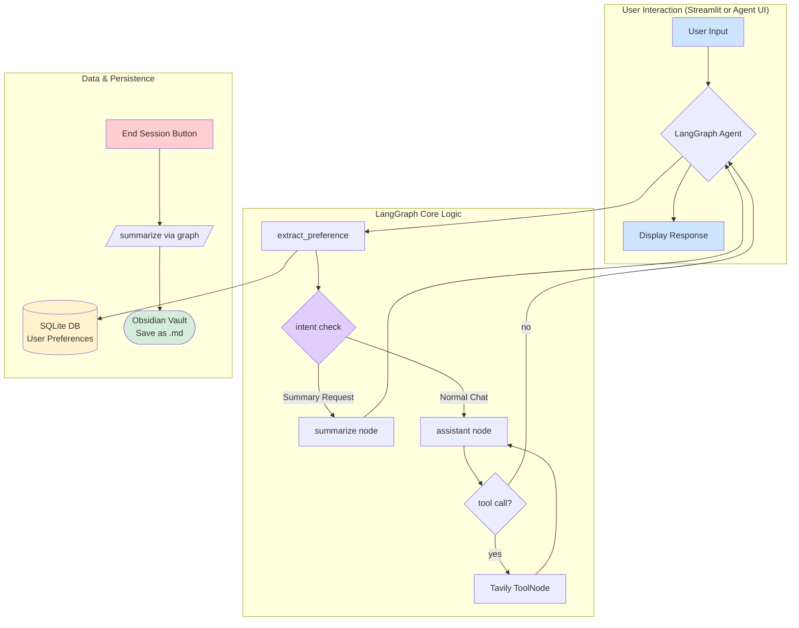

# CogniGraph 🧠

CogniGraph is an AI-powered research assistant designed to help you learn new concepts. It provides a conversational interface to explore topics, performs real-time web searches for up-to-date information, and summarizes key points at the end of your session.

A key feature of CogniGraph is its integration with Obsidian. It automatically saves summarized notes to your vault, wrapping related concepts in `[[double brackets]]` to leverage Obsidian's powerful graph view and create a connected knowledge base.

This project is built using LangGraph, Streamlit, and can be configured to use different Large Language Models (LLMs) like local models via Ollama or proprietary models from OpenAI.

## Architecture Diagram

The following diagram illustrates the flow of information within the CogniGraph agent:



## Features

- **Conversational AI**: Engage in a natural conversation to ask questions and learn.
- **LLM Agnostic**: Easily switch between a locally hosted Ollama model (e.g., Gemma, Llama) and OpenAI's models (e.g., GPT-4o) via a simple configuration change.
- **Web Search**: Integrates with Tavily Search API to provide current information on any topic.
- **Native Tool Calling**: Uses LangChain tool binding + LangGraph `ToolNode` for web search.
- **In-Graph Summarization**: Summarization is part of the same graph and works from both Streamlit and Agent UI.
- **Obsidian Integration**: Automatically saves summaries as Markdown files in a specified Obsidian vault, creating links between concepts for graph visualization.
- **Persistent Memory**: Stable user preferences are extracted and stored as key-value pairs in a local SQLite database.
- **Dual UI Support**: Works in Streamlit and in Agent UI / LangGraph Studio.
- **Logging**: Detailed logs are generated in the `logs/` directory for easy debugging and monitoring.

## Project Structure

```
.
├── src/
│   └── cognigraph/
│       ├── ui.py           # Streamlit UI
│       ├── graph.py        # Unified LangGraph workflow (chat + tools + summarization)
│       ├── llm.py          # LLM provider factory
│       ├── server_graphs.py # LangGraph API entrypoint
│       ├── db.py           # SQLite persistence layer
│       ├── config.py       # Environment config loader
│       └── logging_setup.py
├── app.py                  # Thin Streamlit entrypoint
├── langgraph.json          # LangGraph server config
├── pyproject.toml          # uv project configuration
├── .env / .env.example     # Environment variables
├── logs/                   # Log files
└── README.md               # This file
```

## Setup and Installation

1.  **Prerequisites**:
    *   Python 3.12+
    *   An active internet connection
    *   (Optional) [Ollama](https://ollama.com/) installed and running for local LLM usage.

2.  **Clone the Repository**:

3.  **Install uv**:
    Follow the official instructions: https://docs.astral.sh/uv/getting-started/installation/

4.  **Create the Environment and Install Dependencies**:

    ```bash
    uv sync
    ```

5.  **Configure Environment Variables**:
    Create a file named `.env` in the root of the project directory and populate it with your configuration. A template is provided below.

## Configuration (`.env` file)

Copy the following into your `.env` file and replace the placeholder values with your actual information.

```ini
# --- LLM Configuration ---
# Set the provider: "ollama", "openai", etc.
LLM_PROVIDER="ollama" 
# Set the model name for the selected provider (e.g., "gemma", "gpt-4o")
LLM_MODEL="gemma"
# Set the base URL for the LLM API (required for local models like Ollama)
LLM_BASE_URL="http://localhost:11434"

# --- API Keys and Paths ---
# Required if using LLM_PROVIDER="openai"
OPENAI_API_KEY="your-openai-api-key"
# Required for web search functionality
TAVILY_API_KEY="your-tavily-api-key"
# Absolute path to your Obsidian vault's root directory
OBSIDIAN_VAULT_PATH="C:/Users/YourUser/Documents/ObsidianVault"
```

**Important**:
- You can get a free Tavily API key from the [Tavily website](https://tavily.com/).
- Ensure the `OBSIDIAN_VAULT_PATH` is an absolute path to your vault's root directory.

## Usage

### Option A: Streamlit App

1.  Install dependencies (if not already done):
    ```bash
    uv sync
    ```

2.  (Optional) Start Ollama if `LLM_PROVIDER="ollama"`:
    ```bash
    ollama run gemma
    ```

3.  Start Streamlit:
    ```bash
    uv run streamlit run app.py
    ```

4.  Open the Streamlit URL (usually `http://localhost:8501`) and chat normally.

5.  Summarize conversation:
    - Type `/summarize` in chat, or
    - Click **End Session & Save Notes** (this now triggers summarization through the same graph).

6.  If Obsidian path is configured, summary is saved under `AINotes/` in your vault.

### Option B: LangGraph API + Agent UI / Studio (Local)

Run the unified graph as an API and connect from Agent UI or Studio.

1.  **Start local LangGraph API server**:
    Standard command:
    ```bash
    uv run langgraph dev
    ```

    If your environment blocks `langgraph` directly due to Application Control, use:
    ```bash
    uv run python -m langgraph_api.cli --config langgraph.json
    ```

    API endpoint is typically `http://127.0.0.1:2024`.

2.  **Open Agent UI / Studio**:
    - `uv run langgraph dev` prints a Studio URL automatically.
    - Or open manually:
      `https://smith.langchain.com/studio/?baseUrl=http://127.0.0.1:2024`

3.  **(Optional) Run standalone Agent Chat UI app**:
    ```bash
    npx create-agent-chat-app --project-name cognigraph-chat-ui
    cd cognigraph-chat-ui
    pnpm install
    pnpm dev
    ```

4.  **Connect UI to your local graph**:
    - Graph ID: `cognigraph`
    - Deployment URL: `http://127.0.0.1:2024`
    - LangSmith key: optional for local usage

5.  **Trigger summarization in Agent UI**:
    - Send `/summarize` in chat.
    - The same unified graph handles chat, tools, and summarization.

This setup is configured via [langgraph.json](langgraph.json).

## Logging

All application events, including API calls, node executions, and errors, are logged to `logs/app.log`. This is the first place to check if you encounter any issues.
